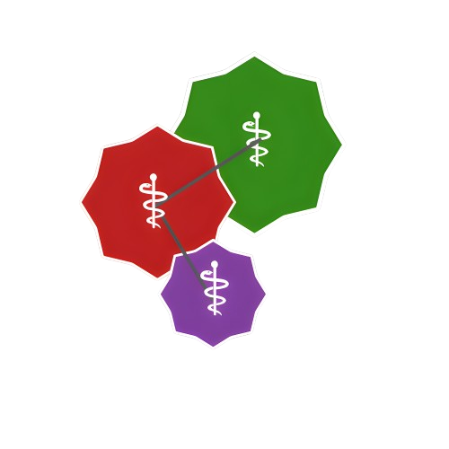

  
  <h1>MedImages.jl</h1>
  
<em>A comprehensive Julia library for standardized 3D and 4D medical imaging data handling</em>

 

## Overview

MedImages.jl provides a standardized framework for handling 3D and 4D medical imaging data. The metadata structure is loosely based on the BIDS format [1](#references).

This project aims to create a unified approach to medical image processing across various modalities including CT, MRI, and PET scans. Currently, ultrasonography support is not included, and we welcome contributors with expertise in this area.

## Features & Development Roadmap

### 1. Data Structure Design

The core data structure will manage:

- **Voxel data** as multidimensional arrays
- **Spatial metadata**:
  - Origin coordinates
  - Orientation information
  - Spacing/resolution data
- **Image classification**:
  - Primary type (CT/MRI/PET/label maps)
  - Subtype (e.g., MRI: ADC/DWI/T2)
  - Voxel data type (e.g., Float32)
- **Study metadata**:
  - Acquisition date/time
  - Patient identifiers
  - Study/Series UIDs
  - Study descriptions
  - Original filenames
- **Display properties**:
  - Color mappings for labels
  - Window/level values for CT scans
- **Clinical data**:
  - Patient demographics
  - Contrast administration status
- **Additional metadata** stored in extensible dictionaries

### 2. Data Loading Capabilities

Support for common medical imaging formats:
- **NIfTI** files via Nifti.jl
- **DICOM** files via Dicom.jl
- **MHA** format (implementation pending)

### 3. Spatial Transformations

Advanced spatial processing with metadata preservation:
- **Orientation standardization** to a common reference frame (e.g., RAS)
- **Spacing/resolution adjustment** with appropriate interpolation methods
- **Cross-modality resampling** for multi-modal registration
- **Region-of-interest operations** (cropping, dilation) with origin adjustments

### 4. Persistence Layer

Efficient storage and retrieval mechanisms:
- **HDF5-based storage** for arrays with metadata attributes
- **Device-agnostic I/O** operations (CPU/GPU)
- **Format conversion** for exporting to standard medical formats

## Development Status

This project is under active development. The spatial transformation components (point 3) present the most significant challenges due to numerous edge cases. We're exploring solutions based on packages like [MetaArrays.jl](https://github.com/haberdashPI/MetaArrays.jl).

## Contributing

Contributions are welcome! If you have expertise in medical imaging, particularly ultrasonography, or experience with the technical challenges described above, please consider getting involved.

## References

[1] Gorgolewski, K.J., Auer, T., Calhoun, V.D. et al. The brain imaging data structure, a format for organizing and describing outputs of neuroimaging experiments. Sci Data 3, 160044 (2016). https://www.nature.com/articles/sdata201644