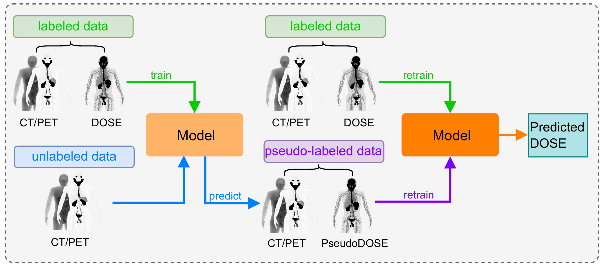

# SemiDose
**Semi-supervised learning for dose prediction in targeted radionuclide therapy: a synthetic data study.**



👉 The paper has been accepted in [Physics in Medicine & Biology](https://iopscience.iop.org/article/10.1088/1361-6560/ae36df/meta).  

👉 Code:    
* [requirements.py](./src/requirements.py), necessary Python libs    
* [data_load.py.py](./src/data_load.py), load dataset
* [model_load.py](./src/model_load.py), load model
* [hyper_parameter.py](./src/hyper_parameter.py), hyper-parameters
* [train_regfixmatch.py](./src/train_regfixmatch.py), model training, validation and test process

⭐ Highlights:    
* We develop an effective radiotherapy dose estimation method based on semi-supervised deep learning.
* We propose a new pseudo-label generation algorithm in SSL that can better adapt to regression-based tasks.


### Requirements

* Python 3.*  
* Pytorch 1.x or 2.0

### Citation

```
@article{Zhang_2026,
doi = {10.1088/1361-6560/ae36df},
url = {https://doi.org/10.1088/1361-6560/ae36df},
year = {2026},
month = {jan},
publisher = {IOP Publishing},
volume = {71},
number = {2},
pages = {025005},
author = {Zhang, Jing and Bousse, Alexandre and Pham, Chi-Hieu and Shi, Kuangyu and Bert, Julien},
title = {Semi-supervised learning for dose prediction in targeted radionuclide therapy: a synthetic data study},
journal = {Physics in Medicine & Biology},
}
```
